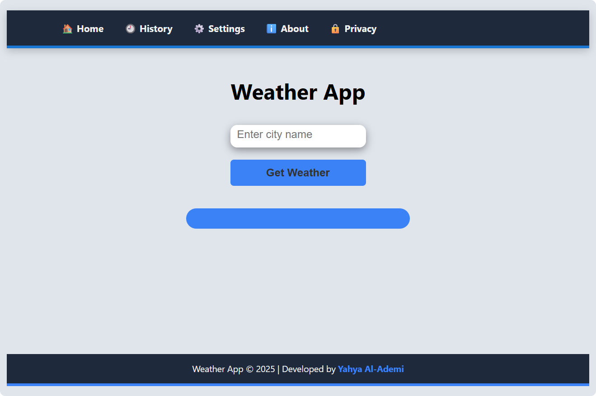
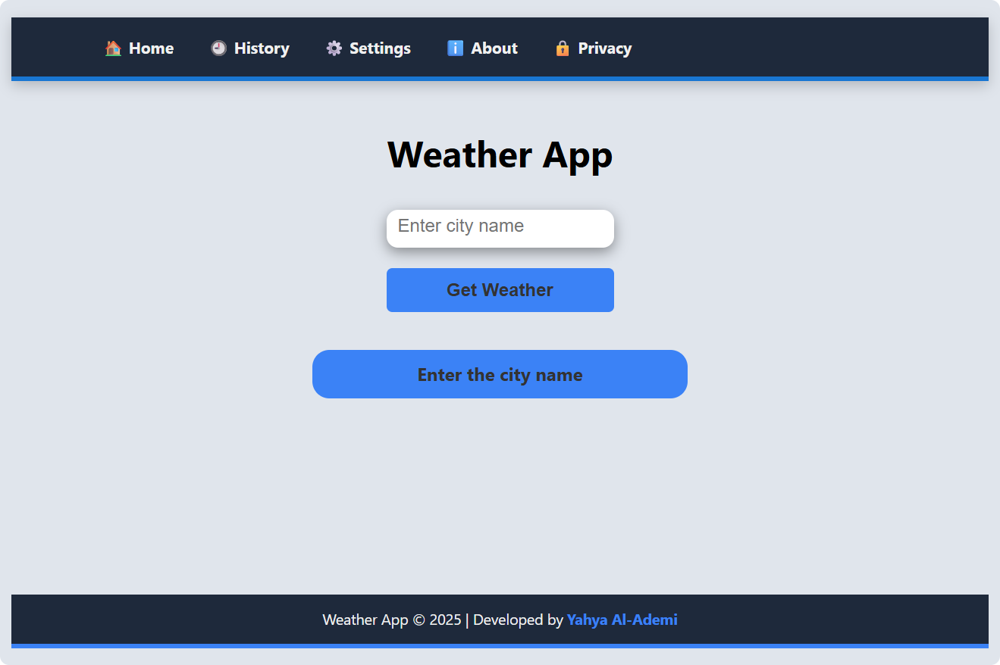
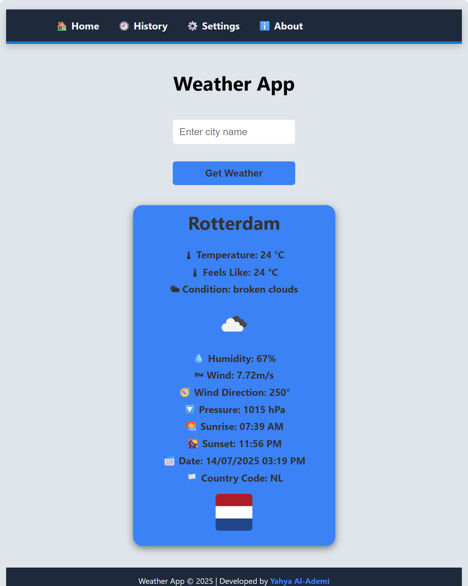
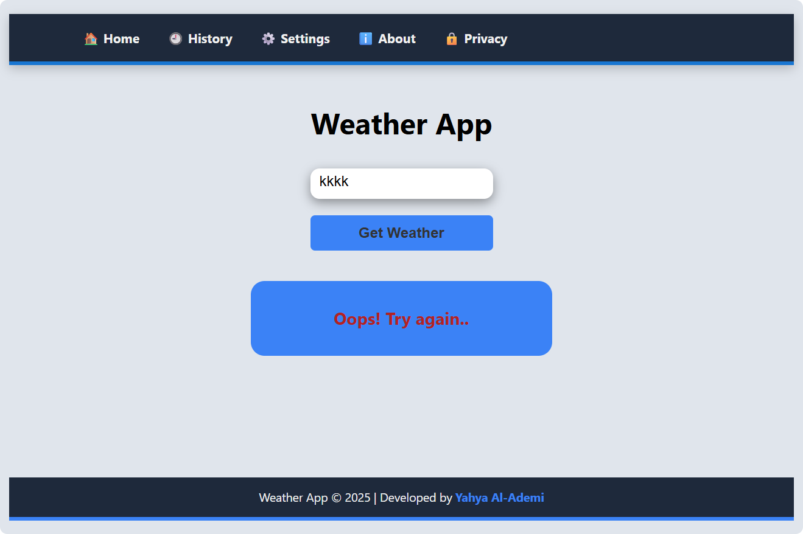
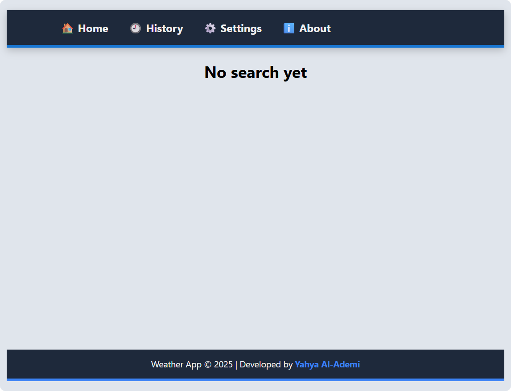
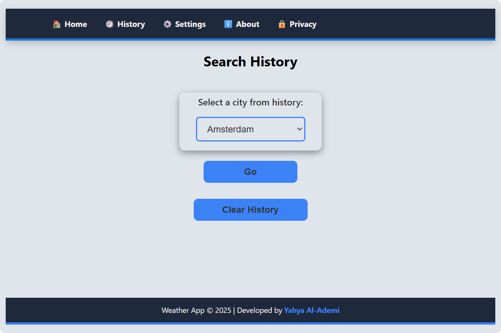
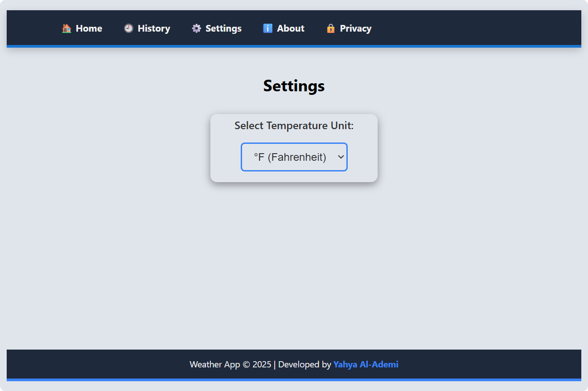
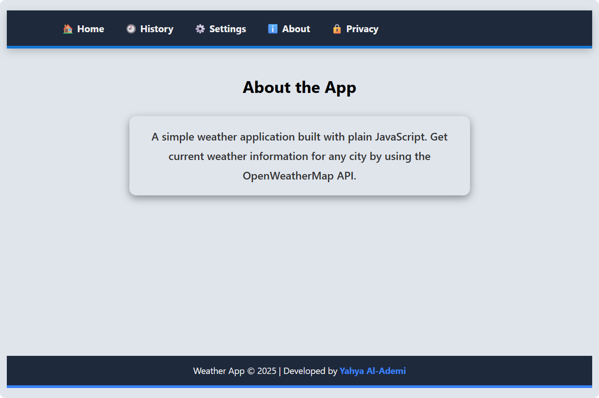

# Weather App

A simple, responsive weather application built with **vanilla JavaScript**.  
Get real-time weather data for any city using the **OpenWeatherMap API**.

---

## Features

- Search weather by city name
- Display:
  - Temperature
  - Feels like
  - Humidity
  - Wind speed and direction
  - Pressure
  - Sunrise & sunset time
- Weather conditions shown with emojis and icons
- Save and reuse search history
- Choose between **Celsius** and **Fahrenheit**
- Fully responsive layout with easy navigation

---

## Installation

### Get Your API Key

1. **Go to OpenWeatherMap**  
   Visit the [OpenWeatherMap API website](https://home.openweathermap.org/api_keys).

2. **Create a Free Account**  
   If you don’t already have an account, sign up for free.
   
3. **Get Your API Key**  
   After logging in, go to the **“API keys”** section in your profile.  
   You’ll see a default key (usually named `Default`), or you can create a new one.

### Add Your API Key to the Project

1. Open the `api` folder.
2. Choose the `apiFetchAndEvent.js` file.
3. Go to **line 36**, and replace `OPEN_WEATHER_API_KEY` with your actual API key:

   ```js
   const API_KEY = "YOUR_ACTUAL_API_KEY_HERE"; // Replace OPEN_WEATHER_API_KEY

---

## How to Use

1. Open the app in your browser.
2. Enter a city name in the input box.
3. Click **Get Weather** or press **Enter**.
4. See the current weather details.
5. Use the navigation links:
   - **Home:** Search weather.
   - **History:** View and reuse past searches.
   - **Settings:** Choose temperature unit.
   - **About:** Learn about this app.
   - **Privacy:** Read the privacy policy. 

---

## APIs Used

- [OpenWeatherMap API](https://openweathermap.org/api) — for weather data.
- [REST Countries API](https://restcountries.com/) — for country flags.

---

## How It Works

- Fetch weather data from OpenWeatherMap API.
- Convert and display data with user-friendly format.
- Save searched cities in `localStorage` for history.
- Let user choose temperature unit and save preference.

---

## Screenshots

All images are stored in the `assets` folder.

1. **App Interface**  
     

2. **Warning Message for Empty City Input**  
     

3. **Weather Display for a Valid City**  
     

4. **Error Message for Invalid City**  
     

5. **History View**  
     

6. **Saved Cities List**  
     

7. **Temperature Unit Settings**  
    

8. **Information About The App**  
    